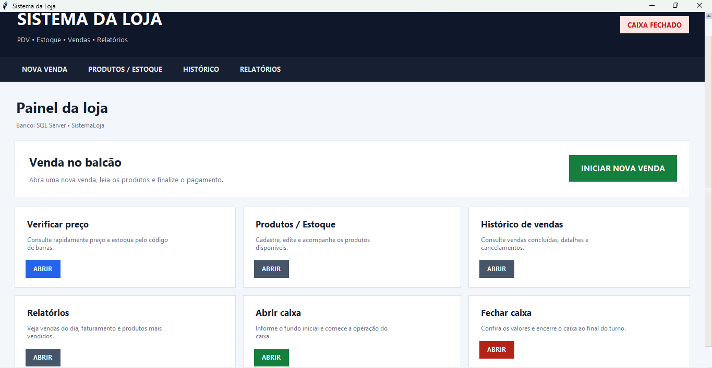
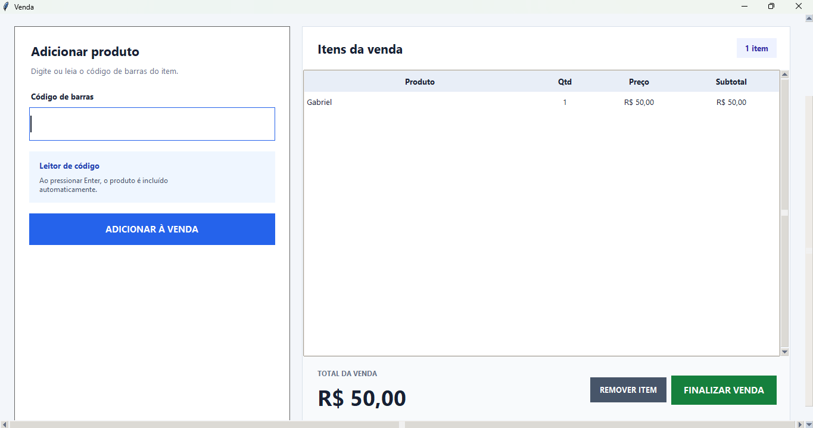
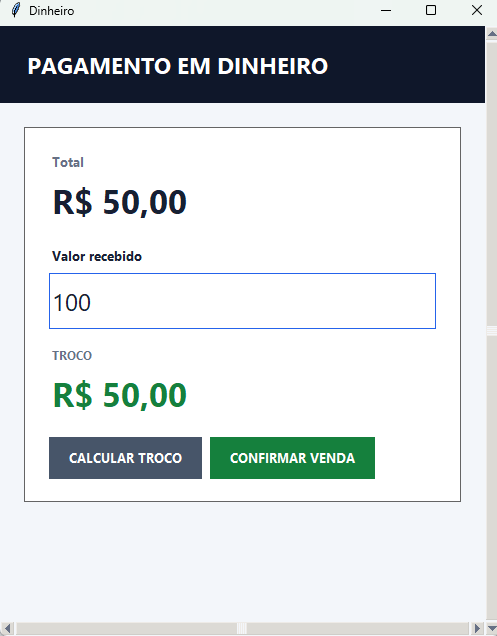
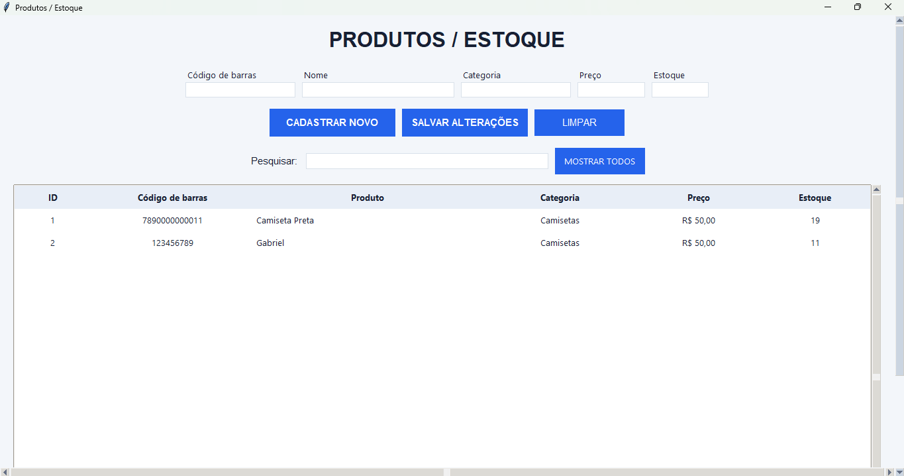

# 🛒 SistemaLoja PDV

Sistema desktop de **Ponto de Venda (PDV)** desenvolvido em Python e integrado ao **Microsoft SQL Server**, criado para auxiliar no controle de vendas, produtos, estoque e operações de caixa de uma loja.

O projeto foi desenvolvido para estudo e portfólio, utilizando **IA como ferramenta de apoio** durante etapas de revisão de código, correção de erros, melhorias na interface e evolução das funcionalidades.

---

## 🖥️ Interface do sistema

### Tela principal

Tela inicial do SistemaLoja, com acesso às principais funções do PDV.



---

### 🛒 Registro de venda

Tela utilizada para adicionar produtos ao carrinho e acompanhar quantidade, preço e valor total da venda.



---

### 💳 Forma de pagamento

Durante a finalização da venda, o sistema permite selecionar diferentes formas de pagamento.


---

### 💵 Pagamento em dinheiro

Para pagamentos em dinheiro, o sistema permite informar o valor recebido e realiza o cálculo do troco.



---

### 📦 Produtos e estoque

Área destinada ao cadastro, consulta e gerenciamento dos produtos disponíveis na loja.



---

## ✨ Funcionalidades

O sistema possui recursos como:

- Cadastro de produtos
- Edição de produtos
- Controle de estoque
- Consulta de preços por código de barras
- Registro de vendas
- Carrinho de compras
- Controle de quantidade dos produtos
- Abertura de caixa
- Fechamento de caixa
- Controle de fundo de caixa
- Pagamento em dinheiro
- Pagamento via PIX
- Pagamento no débito
- Pagamento no crédito
- Cálculo automático de troco
- Histórico de vendas
- Consulta de detalhes das vendas
- Cancelamento de vendas
- Retorno automático dos produtos ao estoque após cancelamento
- Relatórios de vendas
- Ranking de produtos vendidos

---

## 🛠️ Tecnologias utilizadas

### Desenvolvimento

- Python
- Tkinter
- ttk

### Banco de dados

- Microsoft SQL Server
- SQL
- PyODBC

### Outros

- SQLite
- Git
- GitHub
- IA aplicada ao desenvolvimento

---

## 🗃️ Banco de dados

O sistema utiliza o banco:

```text
SistemaLoja
```

Com as principais tabelas:

```text
produtos
caixas
vendas
itens_venda
```

O arquivo `schema.sql` contém a estrutura utilizada para criação das tabelas.

---

## 🏗️ Arquitetura

```text
Usuário / Operador
        │
        ▼
Sistema PDV
Python + Tkinter
        │
        │ PyODBC
        ▼
Microsoft SQL Server
        │
        ├── Produtos
        ├── Estoque
        ├── Caixas
        ├── Vendas
        └── Itens das vendas
```

Mais informações estão disponíveis em:

```text
architecture.md
```

---

## 📂 Estrutura do projeto

```text
sistemaloja-pdv/
│
├── sistema_loja.py
├── migrar_sqlserver.py
├── schema.sql
├── architecture.md
├── requirements.txt
├── README.md
├── LICENSE
│
└── docs/
    └── images/
        ├── pdv-principal.png
        ├── venda.png
        ├── forma-de-pagamento.png
        ├── dinheiro.png
        └── estoque.png
```

---

## 🔄 Migração SQLite → SQL Server

O projeto também possui o script:

```text
migrar_sqlserver.py
```

Ele foi desenvolvido para migrar os dados de uma versão anterior do sistema em **SQLite** para o **Microsoft SQL Server**.

Durante a migração são preservados os IDs utilizados nos relacionamentos entre:

- Produtos
- Caixas
- Vendas
- Itens das vendas

O script também verifica se o banco de destino já possui informações antes de iniciar o processo.

---

## ⚙️ Requisitos

- Python 3
- Microsoft SQL Server
- ODBC Driver 18 for SQL Server

Instale as dependências com:

```bash
pip install -r requirements.txt
```

---

## ▶️ Executando o projeto

Com o SQL Server ativo e o banco configurado:

```bash
python sistema_loja.py
```

A conexão padrão utiliza:

```text
Servidor: localhost
Banco: SistemaLoja
Autenticação: Windows
```

---

## 🤖 Uso de IA no desenvolvimento

Durante o desenvolvimento, utilizei Inteligência Artificial como ferramenta de apoio principalmente para:

- revisão de código;
- identificação de erros;
- depuração;
- sugestões de melhorias;
- evolução da interface;
- análise de segurança;
- documentação;
- organização do projeto.

A IA foi utilizada como suporte no processo de desenvolvimento, enquanto as regras de negócio, testes e decisões sobre o funcionamento do sistema foram sendo avaliadas e ajustadas durante a construção do projeto.

---

## 📊 Integração com Analytics

Os dados gerados pelo SistemaLoja também serviram como base para o desenvolvimento de um **dashboard web**, permitindo analisar indicadores como:

- faturamento;
- quantidade de vendas;
- ticket médio;
- formas de pagamento;
- produtos mais vendidos;
- estoque baixo.

Essa integração permitiu unir **desenvolvimento de sistemas, banco de dados e análise de dados** em um mesmo projeto.

---

## 🚀 Possíveis evoluções

- Controle de usuários e permissões
- Auditoria de operações
- Exportação de relatórios
- Integração direta com o dashboard web
- Backup automatizado
- Instalador da aplicação
- Novos indicadores de vendas e estoque

---

## 👨‍💻 Autor

**Gabriel Nascimento**

Projeto desenvolvido para estudo e portfólio com foco em **Python, SQL Server, Banco de Dados, Sistemas e Análise de Dados**.
